# Indonesia Inequality EDA Report

This report summarizes the current exploratory analysis from `notebooks/eda_indonesia_inequality.ipynb`. It uses the processed annual datasets currently available in `data/processed/`, covering Indonesia from 2000 through 2024.

The analysis is descriptive. It should not be read as a causal model, policy evaluation, or final inequality narrative.

## Executive Summary

The available data already supports a first descriptive story: Indonesia experienced large gains in GDP per capita and steep reductions in poverty between 2000 and 2024, while inequality rose from the early-2000s baseline, peaked around 2013, and remained above its 2000 level in 2024. Labor indicators also improved over the full period, especially vulnerable employment, but the current labor dataset still lacks wages and informal-employment data.

The strongest limitation is source coverage. The World Bank-backed series are usable for baseline EDA, but several fields that matter for household cost pressure and distributional analysis are still blank because they require BPS, ILOSTAT, or another reproducible official source.

Key descriptive findings:

- Real GDP per capita rose from `1,828` constant 2015 US dollars in 2000 to `4,368` in 2024, an increase of about `139%`.
- Nominal GDP per capita rose from `764` current US dollars in 2000 to `4,925` in 2024.
- Average annual GDP growth over 2000-2024 was about `4.89%`; the lowest year was 2020 at `-2.07%`, and the highest was 2007 at `6.35%`.
- Total CPI rose from `44.0` in 2000 to `172.7` in 2024. Annual inflation peaked in this dataset in 2006 at `13.11%` and was `2.18%` in 2024.
- The Gini index rose from `30.3` in 2000 to `34.9` in 2024, with a peak of `38.9` in 2013.
- Distribution shares moved toward the top quintile over the full period: bottom 40% share fell from `22.2%` to `19.9%`, while top 20% share rose from `39.9%` to `43.6%`.
- The tails show the same pattern more sharply: bottom 10% share fell from `4.0%` in 2000 to `3.5%` in 2024, while top 10% share rose from `25.6%` to `28.8%`. The top-10-to-bottom-10 ratio rose from `6.4x` to `8.2x`, peaking at `10.2x` in 2015.
- National poverty fell from `19.1%` in 2000 to `9.0%` in 2024. Extreme poverty fell from `65.7%` to `5.4%`.
- Total unemployment fell from `6.08%` in 2000 to `3.30%` in 2024. Youth unemployment fell from `19.15%` to `13.08%`, after peaking at `26.30%` in 2005.
- Vulnerable employment fell from `65.22%` in 2000 to `50.31%` in 2024, but this is not a direct substitute for informal employment.

## Data Readiness

The processed datasets are structurally ready for EDA, but not all schemas are equally populated. GDP, poverty, inequality, and the currently sourced labor indicators are mostly analysis-ready. Inflation is only partly ready because total CPI and year-over-year inflation are populated, while category CPI fields remain blank. Cost-of-living is mostly a placeholder schema because only `cpi_total` is populated.

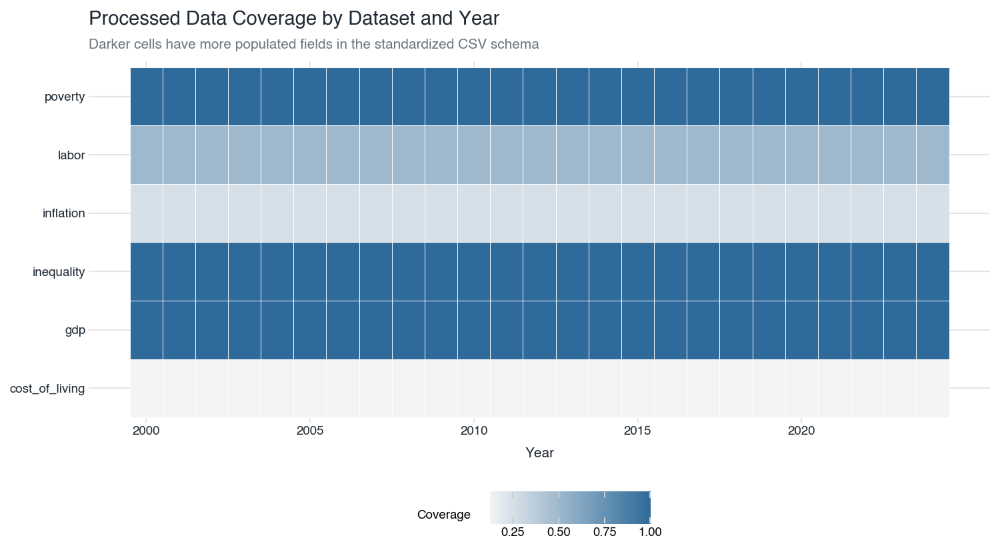

The field-level summary shows why the current analysis can cover macro growth, poverty, Gini, distribution shares, and high-level labor outcomes, but cannot yet make a defensible claim about rice prices, fuel, rent, education costs, healthcare costs, restaurants, wages, or informal employment.

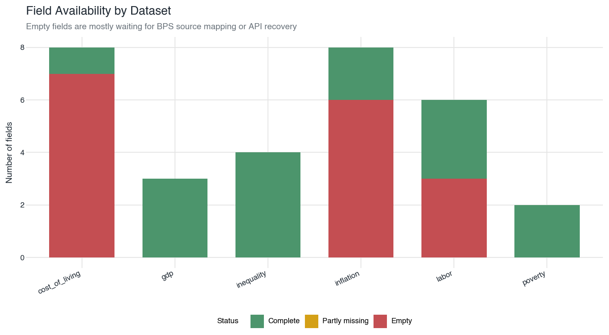

Fields still empty:

- `cost_of_living`: `rice_price`, `fuel_price`, `electricity_index`, `rent_index`, `education_index`, `healthcare_index`, `restaurant_index`
- `inflation`: `cpi_food`, `cpi_transport`, `cpi_housing`, `cpi_education`, `cpi_healthcare`, `cpi_restaurant`
- `labor`: `avg_wage`, `real_wage_growth`, `informal_employment_share`

## Growth and Output

GDP per capita shows a clear long-run increase. Real GDP per capita more than doubled over the period, rising from `1,828` constant 2015 US dollars in 2000 to `4,368` in 2024. Nominal GDP per capita rose more sharply, as expected, because it reflects both real output changes and price/exchange-rate effects.

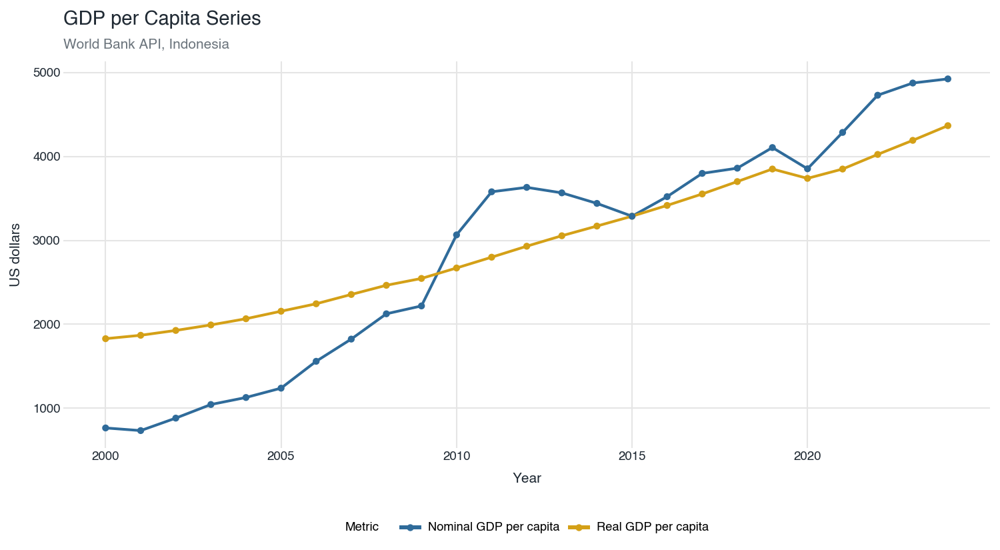

GDP growth was positive in nearly every year in the current sample, with the major exception of 2020. The series shows a pre-Global Financial Crisis high in 2007, a COVID-era contraction in 2020, and recovery afterward.

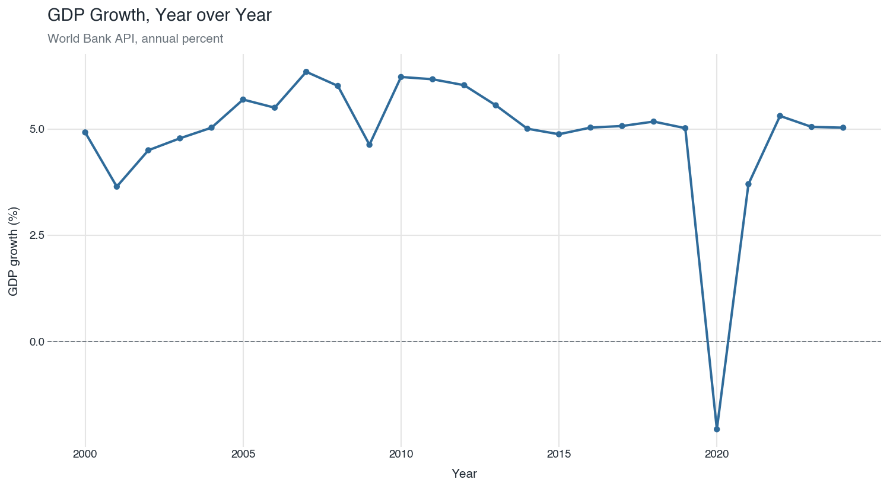

Current interpretation: the macro growth foundation is strong enough for descriptive work. The next analytical question is distributional: how much of this growth aligned with poverty reduction, and how much coincided with persistent or rising inequality?

## Inflation and CPI

Total CPI increased from `44.0` in 2000 to `172.7` in 2024, indicating a large cumulative rise in consumer prices. Year-over-year inflation is volatile in the early-to-mid 2000s, peaks in 2006, and is lower by 2024.

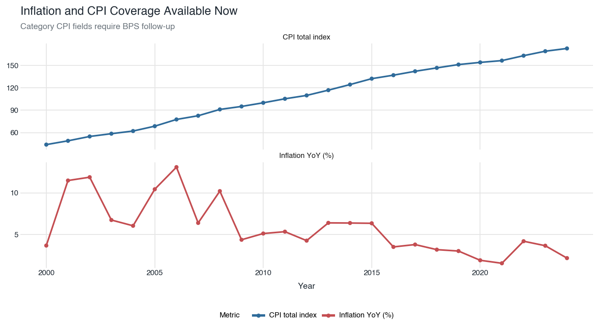

Current interpretation: total CPI can support broad price-level context, but it is not enough for a household cost-of-living story. The missing category CPI and commodity price fields matter because inequality is experienced through specific costs: food, rent, fuel, electricity, education, healthcare, and eating out. Those cannot yet be analyzed directly from the current processed data.

## Inequality and Distribution

The World Bank Gini series indicates that inequality rose from the early-2000s baseline, peaked around 2013, then eased but did not return to the 2000 level by 2024.

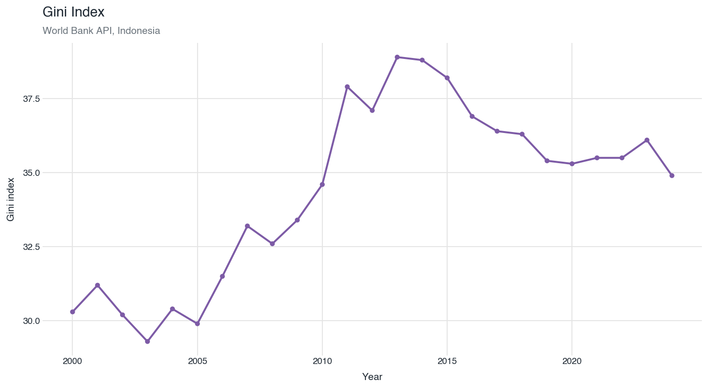

Distribution shares tell a similar story. Between 2000 and 2024, the bottom 40% share declined from `22.2%` to `19.9%`, while the top 20% share rose from `39.9%` to `43.6%`.

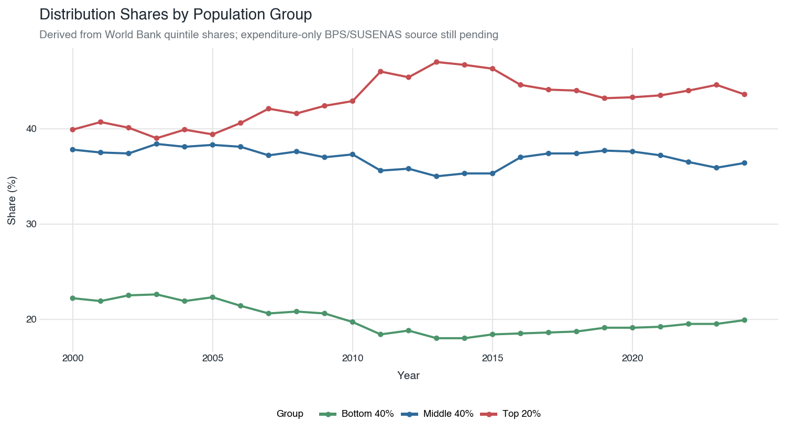

The broad grouped view is useful, but it hides the extremes. The decile view shows a more pointed tail shift: the bottom 10% share declined from `4.0%` in 2000 to `3.5%` in 2024, while the top 10% share increased from `25.6%` to `28.8%`. The top-10-to-bottom-10 ratio rose from `6.4x` to `8.2x`, and reached its highest point in this dataset in 2015 at about `10.2x`.

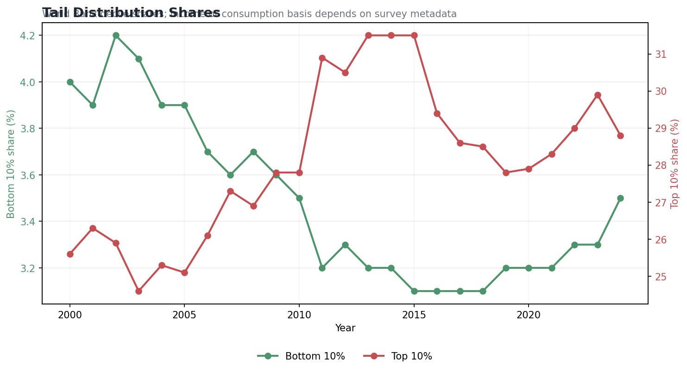

Current interpretation: the available distribution data points to a widening top-versus-bottom share over the full period, even as poverty fell. This is an important tension for the eventual narrative: growth and poverty reduction can coexist with a larger share of income or consumption accruing to the top quintile.

Caveat: World Bank distribution indicators may be income or consumption shares depending on the survey metadata. For an Indonesia expenditure-focused analysis, these should be replaced or cross-checked with BPS/SUSENAS expenditure distribution if a reproducible source can be mapped.

## Poverty

Poverty reduction is the clearest positive long-run pattern in the current dataset. National poverty fell from `19.1%` in 2000 to `9.0%` in 2024. Extreme poverty fell much more sharply, from `65.7%` to `5.4%`.

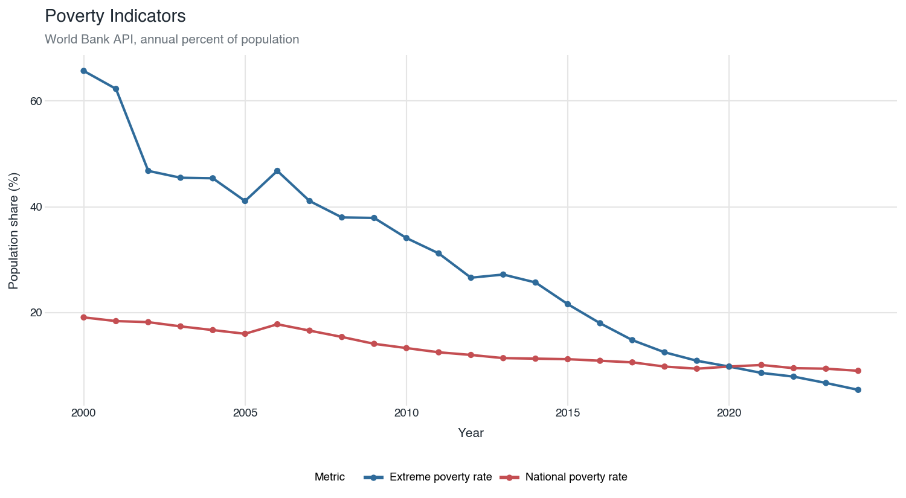

Current interpretation: the poverty trend strongly suggests broad welfare improvement over the period. However, the inequality indicators show that poverty reduction does not automatically imply distributional equalization. The next version of the analysis should examine whether the poor became less poor while relative shares still shifted upward toward the top.

## Labor Market

Total unemployment declined over the full period, from `6.08%` in 2000 to `3.30%` in 2024. Youth unemployment also declined over the full period, but remains structurally higher than total unemployment. Vulnerable employment fell from `65.22%` to `50.31%`, suggesting a long-run shift away from more precarious employment categories.

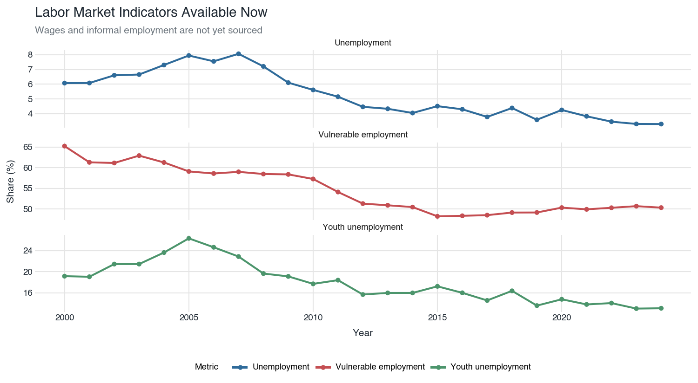

Current interpretation: the labor data supports a cautious story of improvement in employment conditions, but it is incomplete. Wages, real wage growth, and informal employment are essential for understanding whether workers captured enough of the gains from growth and whether employment became materially more secure. Those fields are not yet sourced.

## Cost of Living

The cost-of-living dataset is not ready for substantive analysis. Only total CPI is populated; all item and category fields are blank.

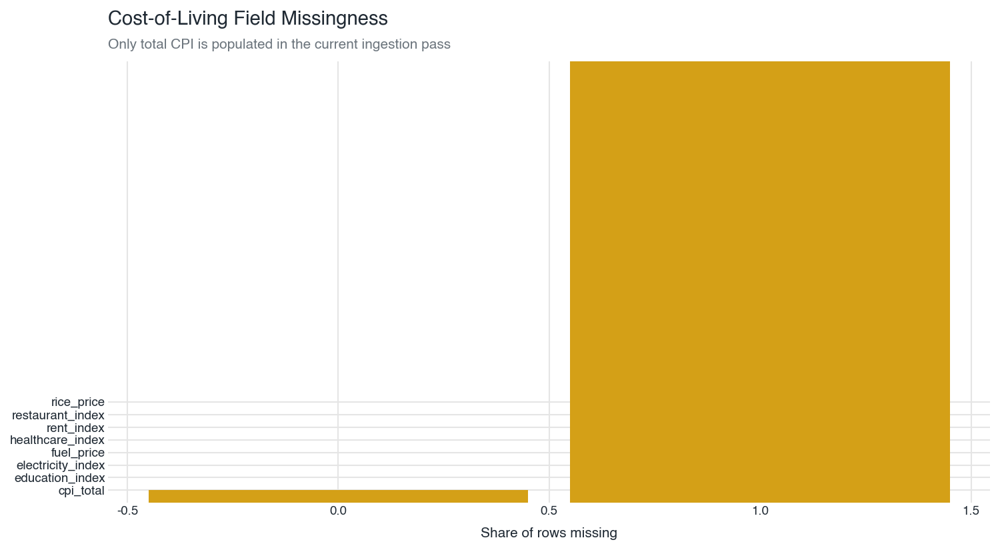

Current interpretation: do not draw claims about rice, fuel, electricity, rent, education, healthcare, or restaurant costs from this dataset yet. The schema is useful as a destination for future BPS-backed ingestion, but it is not currently evidence.

## Working Interpretation

The current evidence supports a balanced preliminary interpretation:

Indonesia's economy grew substantially from 2000 to 2024, and poverty fell sharply. At the same time, inequality indicators worsened relative to 2000, with the top 20% and top 10% receiving larger distribution shares by 2024 while the bottom 40% and bottom 10% received smaller shares. The Gini peak around 2013 suggests inequality pressure intensified during the high-growth period, then moderated but remained above the starting point.

The story should not be framed as "growth failed" because poverty and employment indicators improved materially. It should also not be framed as "growth solved inequality" because the distribution indicators do not support that. The better current framing is:

> Indonesia's 2000-2024 growth period appears to have reduced poverty substantially, but the gains were not evenly distributed enough to return inequality to its early-2000s level.

That statement is still provisional because household cost pressure, wages, informal employment, and BPS/SUSENAS expenditure distribution remain missing.

## What To Review Next

Before turning this into a final article or dashboard, the next data work should focus on:

- Map BPS category CPI fields for food, transport, housing/electricity/fuel, education, healthcare, and restaurants.
- Add official rice, fuel, electricity/LPG, rent, education, and healthcare cost series.
- Add average wage, real wage growth, and informal employment from BPS or ILOSTAT.
- Replace or validate World Bank distribution shares with BPS/SUSENAS expenditure distribution.
- Add a validation script for expected columns, year ranges, and intentionally blank placeholder fields.
